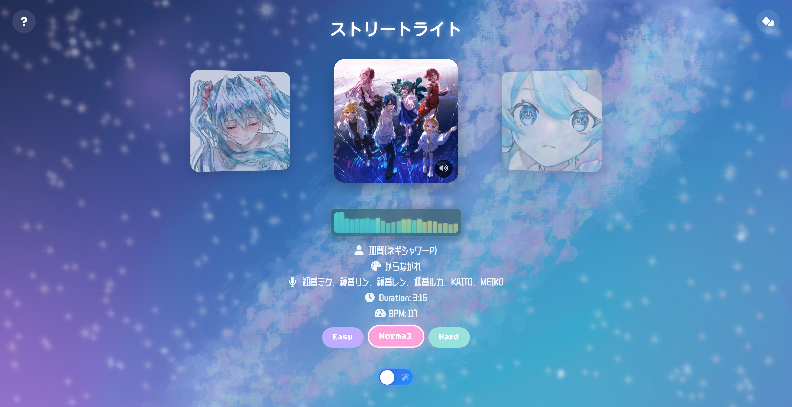
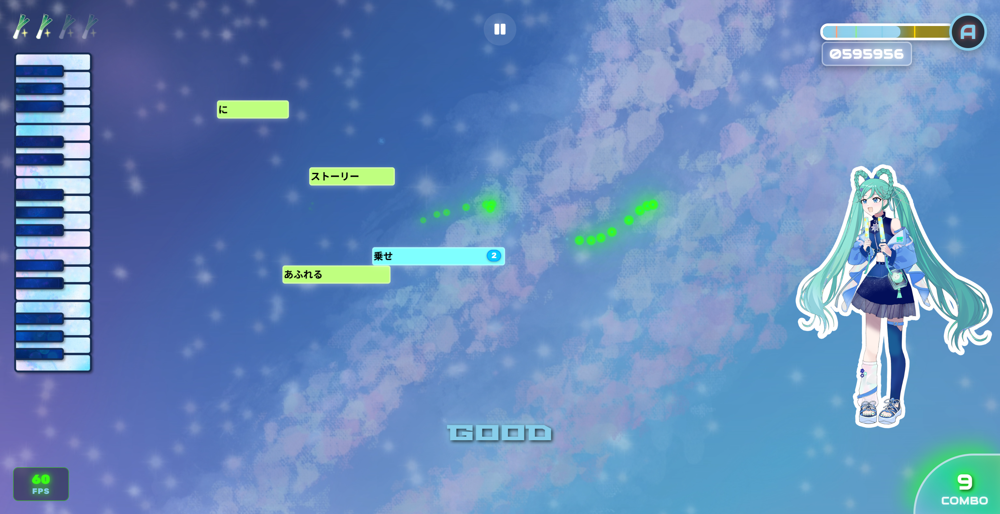

# Penlight Strike

Code for Hatsune Miku “Magical Mirai 2025” Programming Contest using TextAlive App API.
In this project, we build a rhythm game using TextAlive App API.
When the game starts, multiple notes with song lyrics will be generated from the piano roll, just like the interface of VOCALOID.
Players can use their mouse and strike the notes, preventing them to fall.
It also have a more immersive mode, where players can swing their penlight and chant for Miku.
Try to achieve higher score and enjoy the game and songs!
日本語版のリードミーは[こちら](./README_en.md)から入手できます。

### [Play on Itchio](https://starydyxyz.itch.io/penlight-strike) | [Watch Demo Video](https://www.youtube.com/watch?v=NQfmGNHrg-c)


## Usage

Start a local server to run the project.

```shell
# using http-server (recommended)
http-server -p 8000

# or using python server
python -m http.server 8000
```

Access the website at `https://localhost:8000`.

## Navigation System

At the beginning, a welcome page will be displayed to show the game title and credits.
It requires user interaction to start the game and song preview.
After clicking, a song selection page will be displayed.
A five song carousel system is implemented to show the song covers and achieve smooth animation.
Difficulties can be selected, deciding the note amount, HP, and timing judgment.
We also implement a tutorial page to guide the user how to play the game.
After the game, a result page will be displayed to show the final score and achievements.



## Gameplay System

In the game, notes with lyrics will be generated following the song, using the TextAlive App API.
The notes is in the style of VOCALOID, and the width of them are decided by the duration.
Players need to touch the notes before they fall, while avoid touching the red distracting notes.
There are also special blue notes which need multiple touches.
Notes can only be touched and removed with the beat of the song, so players need to follow the chanting of Miku and the rhythm of the song.
When penlight mode is enabled at song selection page, camera of the device will be activated and the real penlight will be tracked.
In this way, players can use their penlight to strike the notes, achieving a more immersive experience.



## Implementation

In this project, we use vanilla JavaScript, HTML and CSS to achieve all the features.
For the basic utilities of lyrics, beat and song synchronization, we use the TextAlive App API.
For the penlight tracking, we first record video clips with penlight swinging under different conditions to form a penlight dataset.
Then, we use Tensorflow to train a efficient network for penlight key point detection.
It locates the head of the penlight by regressing a heat map using a CNN U-Net structure.
The model is implemented to web browser using Tensorflow.js.
Finally, to achieve smooth and accurate tracking of the penlight, we use a Kalman filter under uniform velocity model to filter penlight position and increase FPS.
The project can be run on any modern web browser using PC, mobile phone or tablet.

## Words from the Developers

As a beginner of front-end development, this is my first time independently creating such a large-scale project. With a mindset of learning by doing, I tried many interesting things for the first time—drawing, music composition, designing a logo, and developing the game logic. Watching this app evolve from just an idea into a playable product brought tears to my eyes.
I want to thank 百鬼伏羲 for the artwork, 杰克蔚博 for helping me with voice tuning, and Haru for translating the text to Japanese. I also deeply appreciate the producers who provided the songs, and the illustrators who drew the covers.
Special thanks to Crypton Future Media and TextAlive for giving us such a valuable opportunity. Even as someone who can neither draw nor make music, I was able to participate in a project related to Hatsune Miku. I'm truly proud of myself!
